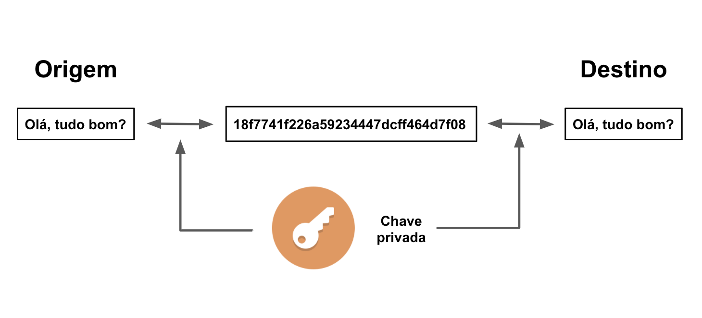

Yuri Lima Almeida - 11621EMT022
Exercício da Semana 12
--------------------------------------------------
## Questão 1

- **Desativar a senha do login SSH**
O recomendado é desabilidar as senhas para ssh e utilizar as ssh Keys, visto que, para as senhas sejam efetivas, é necessário que seja uma senha forte, para não ser fácil de receber um ataque do tipo BruteForce, e que não seja  reutilizada em outros serviços. Além disso, é ideal a utilização de um sistema de gerenciamento de senhas. As chaves ssh são muito mais convenientes para estes casos, embora não seja uma garantia que seu sistema será 100% à prova de hackers.
&nbsp;

-  **Desativar acesso direto ao root via ssh**
Se tratando de computadores pessoais e servidores nos computadores pessoais, é muito comum rodar diversos tipos de processos, não sendo necessariamente o sudo (root) do linux. Os servidores geralmente rodam um conjunto específico de processos, logo, é possível criar um usuário específico para este  servidor com permissões de acesso específicas para os processos que serão executados.
&nbsp;

-  **Mudar a porta padrão do SSH**
Ao se configurar o ssh, automaticamente, é configurada a porta de acesso à máquina em uma porta padrão. É recomendado mudar essa porta para evitar sofwares maliciosos que escaneiam portas padrões e atacam as que possuem senhas fracas.
&nbsp;

-  **Desabilitar o IPv6 para o SSH**
Pode existir tráfego malicioso no IPv6. Isso se dá devido ao fato de que o IPv4 possui um bloqueio mais eficiente. O firewall cobre apenas o IPv4.
&nbsp;

-  **Instalação de firewalls**
A ideia, neste caso, é apenas a permissão de passagem pelo firewall dos processos necessários para a execução da aplicação no servidor, fazendo, assim, o bloqueio de portas desnecessárias.
&nbsp;

- **Atualização automática**
Atualizações automáticas em servidor podem quebrar  ocasionalmente as aplicações que estão rodando. Assim, cabe ao operador decidir quando e como o seu sistema deve receber uma atualização. Em resumo, nos auto upgrades, ainda vai ser necessário fazer configurações manualmente e ainda há a possibilidade de causar disrupção no servidor.

--------------------------------------------------
## Questão 2
#### a) Qual o melhor método para armazenar um conjunto de senhas em um sistema embarcado, conectado à rede. 
No vídeo, é apresentado o DES (Data Encryption Standard), desenvolvido pela IBM e escolhido pela NIST (National Institute of Standards and Technology) como padrão de encriptação do governo americano que se baseia em uma chave de 56 bits em blocos. Antes do DES, os métodos de encriptação baseados em substituição feitos por programadores, como o CESAR, eram extremamente simples de serem quebrados. Hoje existem métodos ainda mais efetivos, como Rijndael, que conseguem utilizar chaves de até 256 bits, ou seja, 2 elevado a 256 possíveis chaves.

#### b) Elabore um diagrama e uma breve explicação de como uma criptografia simétrica acontece.
A criptografia simétrica ocorre quando a origem e o destino compartilham uma mesma chave e não a compartilham com ninguém, somente eles podem entender a mensagem, garantindo, assim, a privacidade e a autenticidade. Mas esse método apresenta uma desvantagem que é a troca da chave.

#### c) Diferença entre um sistema de criptografia e um hash de validação. 
Um hash é uma sequência de bits geradas por um algoritmo de dispersão, em geral representada em base hexadecimal, que permite a visualização em letras e números (0 a 9 e A a F), representando um nibble cada. O conceito teórico diz que "hash é a transformação de uma grande quantidade de dados em uma pequena quantidade de informações". Uma das utilidades do uso dos hashs é ser uma impressão digital. 

Diferentemente da criptografia simétrica os hashs não utilizam chaves, mas, sim, utilizam um valor de hash de tamanho fixo, o qual é um valor matemático computado sobre o texto plano, usando algoritmos específicos.

--------------------------------------------------
## Questão 3
#### a) A relação entre sistemas de criptografia e a geração de hashes do bitcoin.
Uma das características que tornaram o bitcoin famoso é o fato de ser possível conseguir moedas apenas “emprestando” o processamento do computador para auxiliar o protocolo a executar as transações, uma atividade chamada de mineração. Ele é responsável por criar hashs que validam cada operação e, por isso, recebe bitcoins como recompensa.

Sempre que pessoas enviam e recebem valores em bitcoin, o registro básico da operação é adicionado a uma base pública, chamada de blockchain. Também chamado de cadeia de blocos, esse banco de dados públicos armazena os valores de todas as transações feitas por meio do protocolo bitcoin.

#### b) Explique como funciona a comunicação e infraestrutura do sites https e a arquitetura de rede para a implementação do protocoloTSL/SSL.
O HTTPS é uma extensão segura do HTTP. Os sites que configurarem um certificado SSL/TLS podem utilizar o protocolo HTTPS para estabelecer uma comunicação segura com o servidor.

SSL significa Secure Sockets Layer, um tipo de segurança digital que permite a comunicação criptografada entre um site e um navegador. Atualmente a tecnologia se encontra depreciada e está sendo completamente substituída pelo TLS.

TLS é uma sigla que representa Transport Layer Security e certifica a proteção de dados de maneira semelhante ao SSL. Como o SSL não está mais de fato em uso, esse é o termo correto que deveria ser utilizado.

#### c) Pesquise em outras fontes e explique o que é um certificado digital e como funciona o sistema ICP-Brasil, do Instituto Nacional de Tecnologia da Informação (ITI). 
O Certificado Digital é a identidade digital da pessoa física e jurídica no meio eletrônico. Ele garante autenticidade, confidencialidade, integridade e não repúdio nas operações que são realizadas por meio dele, atribuindo validade jurídica.

A Infraestrutura de Chaves Públicas Brasileira – ICP-Brasil é uma cadeia hierárquica de confiança que viabiliza a emissão de certificados digitais para identificação virtual do cidadão.

Observa-se que o modelo adotado pelo Brasil foi o de certificação com raiz única, sendo que o ITI, além de desempenhar o papel de Autoridade Certificadora Raiz – AC-Raiz, também tem o papel de credenciar e descredenciar os demais participantes da cadeia, supervisionar e fazer auditoria dos processos.